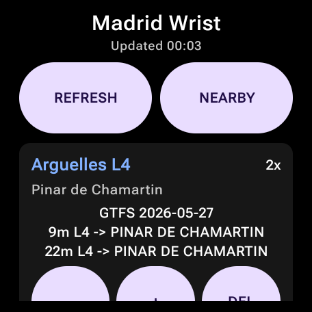
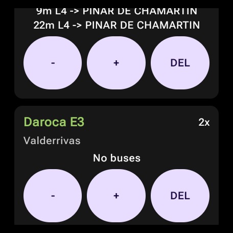
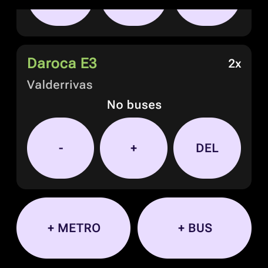
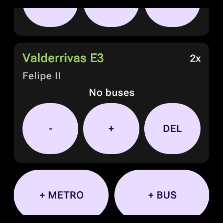
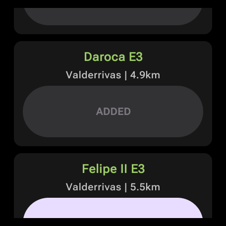

# Madrid Wrist

`Madrid Wrist` is the product surface of this repository. The app still keeps
the closed-loop Wear OS build/install/screenshot workflow, but the launcher now
opens a transport dashboard instead of the developer examples gallery.

## Behavior

The watch app can be operated entirely from Wear OS:

- Shows a persisted list of Metro and bus favorites grouped into generic
  profiles: `Perfil 1`, `Perfil 2`, and `Perfil 3`.
- Shows a large top glance card with the soonest cached or freshly loaded
  departure/arrival for the selected profile.
- Adds Metro, Metro Ligero, EMT, and interurban bus options from separate
  search/picker screens into the currently selected profile.
- Opens the Wear OS keyboard for text search and matches the local catalog by
  station, stop, stop ID, line, destination, and aliases without requiring
  accents.
- Uses Metro de Madrid line colors for Metro labels and top glance highlights.
- Lets each favorite choose how many upcoming departures or arrivals to show, but
  keeps count/delete controls behind an explicit `EDIT` mode to make the default
  path glance-first.
- Lets each favorite opt into distance activation with a proximity radius of
  `500m`, `1km`, or `2km`. The setting is stored with the favorite and can be
  evaluated against the last known watch location.
- Refreshes only the currently selected profile from the watch. Other profiles
  keep their last successful cached snapshot until the user switches to them and
  refreshes.
- Avoids automatic API refreshes when a recent complete snapshot already covers
  the selected profile. Tapping `↻` still forces a live refresh when online.
- Uses validated internet when available. Without internet, or when an API
  refresh fails, it falls back to the selected profile's cached snapshot instead
  of clearing useful data.
- Requests location permission from the watch and sorts the local catalog by
  nearest options when a last known location is available.
- Uses only last-known location, rechecked on manual refresh, nearby flows, or at
  most every 10 minutes for proximity-triggered automatic refreshes.
- Feeds the Wear OS Tile and `SHORT_TEXT` complication from the last cached
  snapshot instead of doing network work from those glance surfaces.

Favorites, counts, selected profile, proximity trigger settings, and the latest
transit snapshot are stored in `SharedPreferences`, so the watch keeps useful
data between app launches. The first launch seeds one Metro favorite and one EMT
bus favorite in `Perfil 1`.

## Data Sources

The searchable catalog is generated from official CRTM GTFS downloads exposed by
the CRTM/ArcGIS open-data portal:

```text
CRTM GTFS Red de Metro:                    491 options
CRTM GTFS Red de Metro Ligero:             106 options
CRTM GTFS Red de EMT:                   11,943 options
CRTM GTFS Red de Autobuses Interurbanos: 24,768 options
```

Feed item IDs:

```text
Metro:         5c7f2951962540d69ffe8f640d94c246
Metro Ligero:  aaed26cc0ff64b0c947ac0bc3e033196
EMT:           868df0e58fca47e79b942902dffd7da0
Interurbanos:  885399f83408473c8d815e40c5e702b7
```

The generator writes
`app/src/main/java/com/arfipod/madridinyourwrist/transit/MadridGeneratedTransitCatalog.kt`
with a compact line/stop/destination index. Regenerate it with:

```bash
python3 tools/generate_transit_catalog.py
```

Downloaded GTFS zips are cached under `artifacts/gtfs/`, which is ignored by
Git. The generated Kotlin source is committed so normal builds do not need
network access.

Metro uses the NAP/GTFS implementation documented in
[`metro-madrid-nap.md`](metro-madrid-nap.md). It downloads the Metro de
Madrid GTFS-ZIP dataset with `BuildConfig.NAP_API_KEY` and computes upcoming
scheduled departures locally.

Bus uses the EMT Madrid MobilityLabs implementation documented in
[`emt-madrid-openapi.md`](emt-madrid-openapi.md). It logs in with
`BuildConfig.EMT_CLIENT_ID`/`BuildConfig.EMT_PASS_KEY` or
`BuildConfig.EMT_EMAIL`/`BuildConfig.EMT_PASSWORD`, then calls the stop arrivals
endpoint.

Metro NAP and EMT OpenAPI are the live integrations today. Metro Ligero and
interurban bus options are catalog-only for now: users can find them, save them,
sort them by distance, and use proximity triggers, but refresh shows `Solo
catálogo GTFS` until a live or planned-schedule runtime is added for those feeds.
This version uses the generated official catalog as the sole catalog source; old
hand-curated favorite IDs are not preserved.

## Favorites And Profiles

Profiles are generic buckets for transit favorites. A favorite can represent a
Metro line/station/destination pair or a bus line/stop/destination pair. The
same station or stop can be saved in more than one profile, with independent
counts and proximity trigger settings.

The current watch UI supports three built-in profiles. This version does not
migrate earlier personal profile labels or hand-curated favorite IDs.

## Online And Offline Policy

The Activity is the only surface that talks to Metro/EMT APIs. Before refreshing
it checks for validated internet:

- Automatic refresh: if the selected profile already has a complete snapshot
  saved within the last 3 minutes, render that cache and skip Metro/EMT calls.
- Manual refresh: tapping `↻` always attempts a live refresh when online.
- Proximity triggers: automatic refreshes only call APIs for favorites that are
  manual or inside their selected radius. Favorites outside the radius keep their
  cached data; manual refresh still requests every selected favorite.
- Location: the app never starts continuous location tracking for Madrid Wrist.
  It reads the platform's last-known location on nearby/manual/proximity flows
  and throttles automatic proximity checks to at most once every 10 minutes.
- Online: call the configured Metro and EMT helpers, then save a fresh snapshot
  for options that returned live data.
- Partial online failure: merge fresh results with the previous snapshot. A
  favorite that refreshed successfully replaces its cached item; a favorite whose
  API/config failed keeps its cached item if one exists.
- Online success with no arrivals: clear that favorite's cached item, because the
  API has explicitly reported no upcoming transport.
- Offline: skip network calls entirely and show the last cached snapshot for the
  selected profile. If no cache exists, show a clear no-connection/no-data state.

Tiles and complications always read the stored snapshot and never start network
work themselves. The snapshot stores both the display time (`HH:mm`) and a real
epoch timestamp so the Activity can decide whether automatic cache use is still
fresh.

## Glance Surfaces

The Activity is the only surface that refreshes Metro and EMT data. The Tile and
complication read the last cached snapshot for the selected profile and format it
for quick glances:

```text
Tile title:       Perfil 1 · Madrid
Tile body:        E3 4m
Tile footer:      Daroca E3 · 08:15
Complication:     E3 4m
```

This keeps Tile/complication rendering deterministic and avoids doing expensive
network work from surfaces that should be readable in a few seconds. Their
regular update cadence is intentionally modest: 15 minutes for the Tile and 900
seconds for the complication.

## Screenshots

Captured from the installed debug APK on a real Pixel Watch 3.











## Code Map

```text
MainActivity.kt                    Launcher and direct example-route bridge
MadridInYourWristApp.kt            Wear OS Compose product UI
transit/MadridTransitModels.kt     Catalog, profiles, favorites, counts, distance sorting
transit/MadridGeneratedTransitCatalog.kt Generated official GTFS catalog index
transit/MadridMetroLineColors.kt   Metro, Ramal, and Metro Ligero color palette
transit/MadridTransitSearch.kt     Accent-insensitive station/stop/line matcher
transit/MadridTransitStore.kt      SharedPreferences favorites/profile persistence
transit/MadridTransitSnapshot.kt   Cached next-arrival snapshot for Activity, Tile, complication
transit/MadridTransitRefreshPolicy.kt Online/offline cache decision policy
transit/MadridTransitRuntime.kt    Runtime loading across Metro and bus favorites
transit/MadridLocationProvider.kt  Platform last-known-location helper
transit/MadridNetworkProvider.kt   Platform validated-internet helper
tools/generate_transit_catalog.py  Official CRTM GTFS catalog generator
WearLoopTileService.kt             ProtoLayout Tile fed by cached selected-profile snapshot
WearLoopComplicationService.kt     SHORT_TEXT complication fed by cached selected-profile snapshot
```

## Verification

Preferred local verification:

```bash
source ./scripts/common.sh
./gradlew --no-daemon :app:testDebugUnitTest :app:assembleDebug
```

Runtime validation when a watch or emulator is connected:

```bash
ANDROID_SERIAL=WATCH_IP:ADB_PORT ./scripts/install-watch.sh
ANDROID_SERIAL=WATCH_IP:ADB_PORT ./scripts/launch-watch.sh
ANDROID_SERIAL=WATCH_IP:ADB_PORT ./scripts/screenshot-watch.sh
ANDROID_SERIAL=WATCH_IP:ADB_PORT ./scripts/logcat-watch.sh
```

Direct example routes still work for development:

```bash
source ./scripts/common.sh
ANDROID_SERIAL=WATCH_IP:ADB_PORT adb_cmd shell am start \
  -n "$APP_ID/$MAIN_ACTIVITY" \
  --es example metro
```
