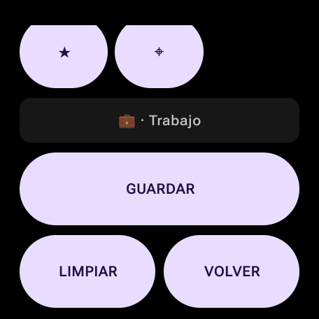
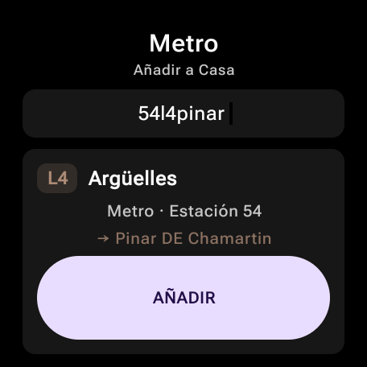
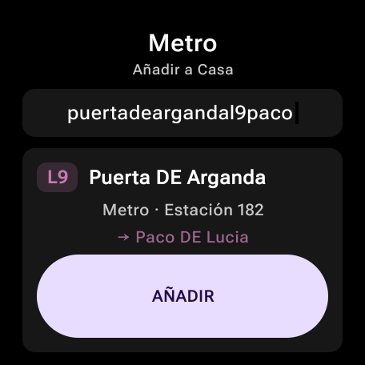
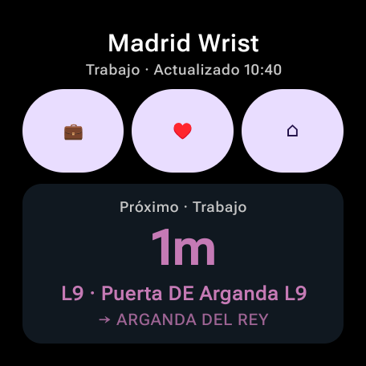
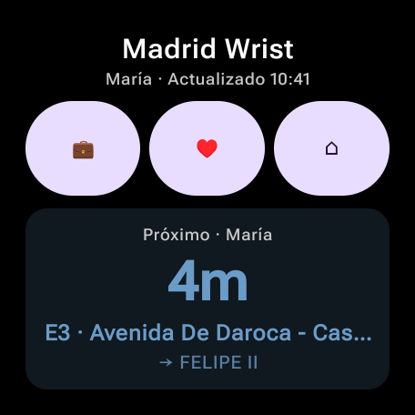
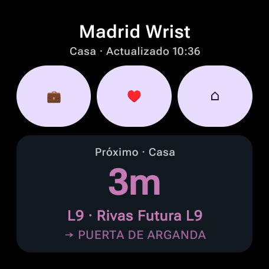
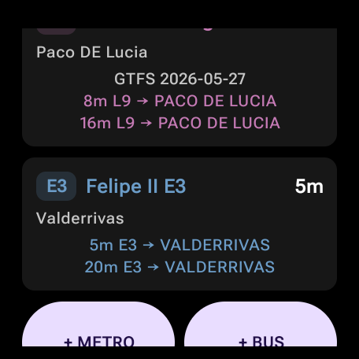
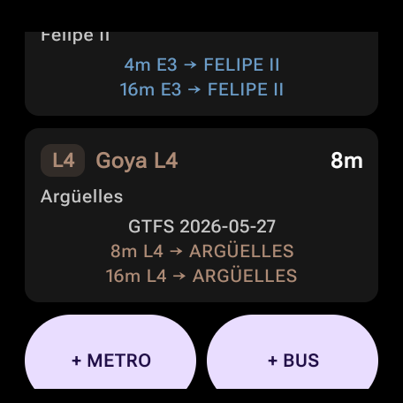

# Madrid Wrist Usability Test

Captured on a Pixel Watch 3 over ADB Wi-Fi on 2026-06-06.

## Goal

Set up three profile groups and verify that profile editing, search, adding
favorites, live refresh, cached rendering, and watch screenshots work end to end.

## Final Fixture

```text
Trabajo  briefcase
- E3 Avenida De Daroca - Casalarreina -> Valderrivas
- L9 Puerta DE Arganda -> Arganda DEL REY

María    heart
- E3 Avenida De Daroca - Casalarreina -> Felipe II
- L4 Goya -> Argüelles

Casa     home
- L4 Argüelles -> Pinar DE Chamartin
- L9 Rivas Futura -> Puerta DE Arganda
- L9 Puerta DE Arganda -> Paco DE Lucia
- E3 Felipe II -> Valderrivas
```

Stored option IDs:

```text
profile_1: bus_emt_e3_1064_valderrivas, metro_9_182_arganda_del_rey
profile_2: bus_emt_e3_1065_felipe_ii, metro_4_61_arguelles
profile_3: metro_4_54_pinar_de_chamartin, metro_9_300_puerta_de_arganda,
           metro_9_182_paco_de_lucia, bus_emt_e3_755_valderrivas
```

## Process Notes

Profile editing was completed from the app:

- `EDIT` -> `PERFIL` exposed profile customization.
- The Wear OS keyboard entered `Trabajo`, `María`, and `Casa`.
- The eligible icon picker saved briefcase, heart, and home.

Favorite search was tested from the app with real picker flows. Useful queries:

```text
54l4pinar
puertadeargandal9paco
```

During the run, ADB-driven text entry exposed two usability issues:

- System Back exited to the launcher from picker screens. The app now handles
  Back inside Madrid Wrist and returns to Home.
- Space-separated or numeric-leading ADB text often remained in the Wear OS IME
  instead of the Compose text field. The search matcher now supports compact
  no-space queries such as `54l4pinar` and long concatenated queries such as
  `puertadeargandal9paco`.

After validating the UI paths and fixing those issues, the exact final fixture
was loaded into debug `SharedPreferences` so the requested groups could be
verified consistently on-device.

## Screenshots

















Full raw run screenshots are under:

```text
artifacts/madrid-wrist-usability-test/
```
