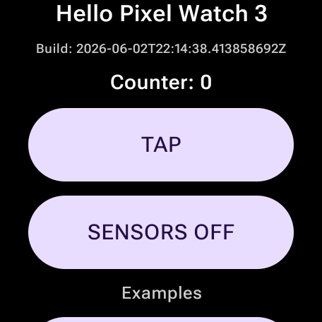
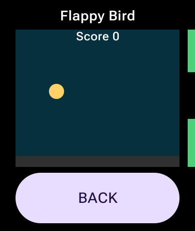
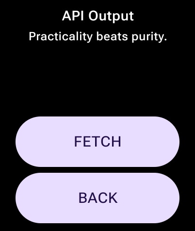
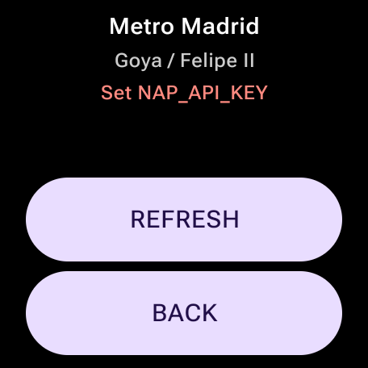
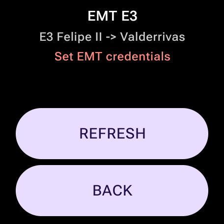
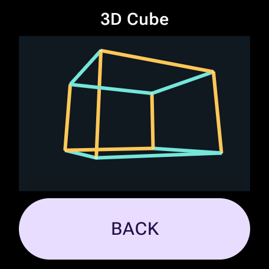
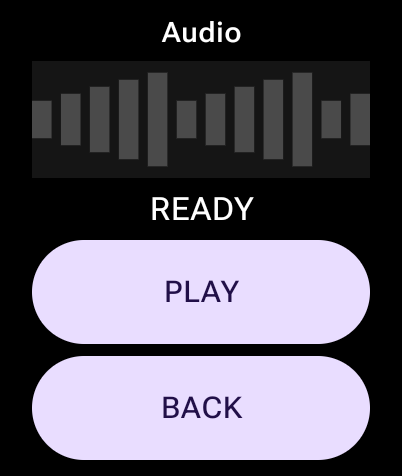
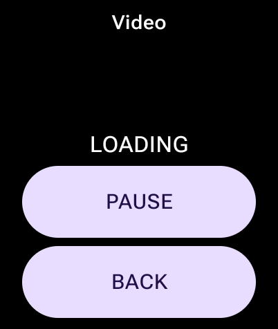

# Wear OS Examples

This folder documents the examples implemented in the app source package:

```text
app/src/main/java/com/arfipod/wearosplayground/examples/
```

The gallery currently includes:

```text
flappy  Flappy Bird-style Canvas game
api     HTTP GET output from a public API
metro   NAP/GTFS scheduled Metro de Madrid departure
emt     EMT E3 realtime arrival at Felipe II toward Valderrivas
3d      Software-projected rotating cube
audio   Platform ToneGenerator playback
video   Platform VideoView playback of a small MP4
```

The normal launcher now opens `Madrid Wrist`. These examples remain available as
direct developer routes with the `example` intent extra documented in
`docs/examples.md`.

## Screenshots

















Full notes and runtime commands live in:

```text
docs/examples.md
```
